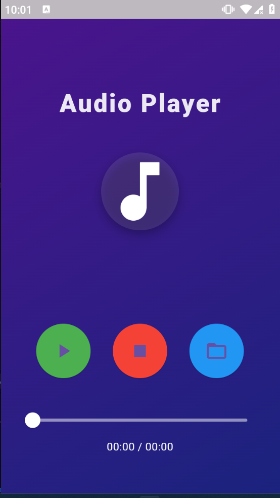

# Audio Player App

Welcome to the **Audio Player App**—your go-to solution for seamless music and audio playback. With an intuitive and stylish interface, this app lets you browse, play, and control your favorite audio tracks. Whether you’re listening to local files or streaming your favorite music, the app provides a fluid and enjoyable experience.

---

## 🎶 **Key Features**

- **Play Your Favorite Audio**: Choose from local audio files and start listening immediately.
- **Smooth Playback Controls**: Play, pause, stop, and seek your audio with intuitive controls.
- **Customizable Audio Experience**: Adjust the track position with a sleek progress bar and enjoy a smooth experience.
- **File Picker**: Pick any supported audio file (MP3, WAV, FLAC, M4A) from your device to play.
- **State Management**: Manage playback state (playing, paused, stopped) and get real-time updates on the current position and duration of the audio.
- **Elegant UI**: A visually appealing gradient background and easy-to-navigate layout to enhance your listening experience.
- **Device Permissions**: Request storage permission to pick audio files from your device.
- **Playlists & Track Navigation**: Seamlessly switch between tracks using intuitive controls.

---

## 🖼️ **Screenshots**

### Home Screen

